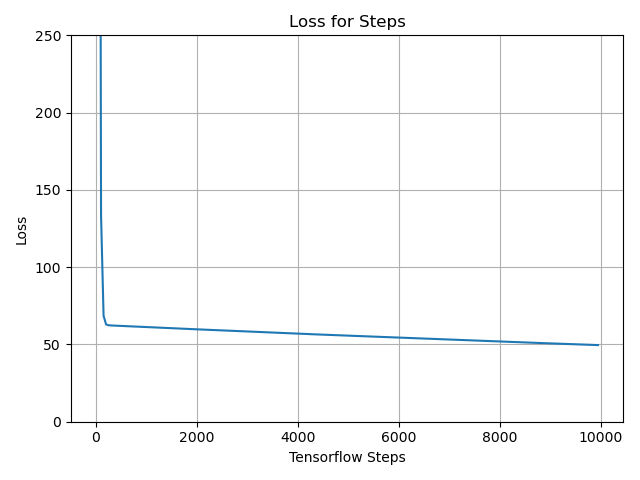
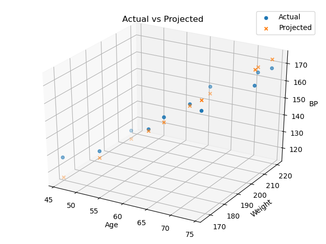

Linear Regresssion with Tensorflow

## Dataset
The simple cengage systolic blood pressure dataset:  
https://college.cengage.com/mathematics/brase/understandable_statistics/7e/students/datasets/mlr/frames/frame.html

## Purpose
Since I implemented linear regression from scratch,  
this is to see if Tensorflow can make it easier

#### Run verified with python 3.7 and numpy 1.18.1
python lin_reg.py

## Loss Per Tensorflow Step (Learning Curve)

## Predicted vs Actual

## Prediction Results over the Training set

|Age|Weight|Actual Blood Pressure|Predicted Blood Pressure|
|:-------:|:---:|:--------------------:|:---------------------:|
|52.0|173.0|132.0|125.03923797607422|
|59.0|184.0|143.0|141.15444946289062|
|67.0|194.0|153.0|159.57180786132812|
|73.0|211.0|162.0|173.38482666015625|
|64.0|196.0|154.0|152.66529846191406|
|74.0|220.0|168.0|175.68699645996094|
|54.0|188.0|137.0|129.64358520507812|
|61.0|188.0|149.0|145.7587890625|
|65.0|207.0|159.0|154.96746826171875|
|46.0|167.0|128.0|111.22621154785156|
|72.0|217.0|166.0|171.08265686035156|